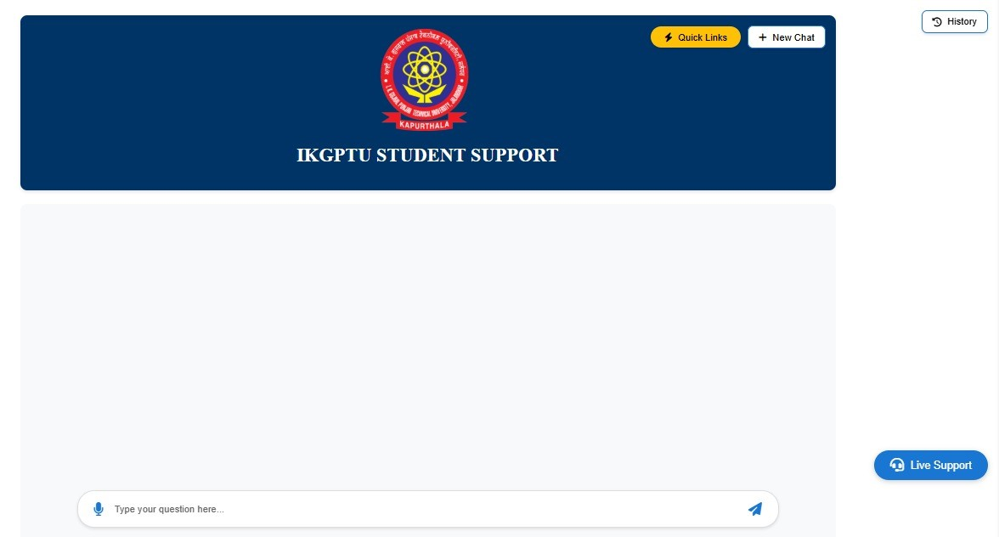

# 🤖 PTU AI-Powered Chatbot

This repository hosts an **AI-powered chatbot** designed to support PTU (IKG Punjab Technical University) students and faculty with FAQs, academic queries, and useful resources. The chatbot integrates with external APIs, supports email notifications, and runs with modern Python tooling.

---

## 📌 Features

* 🎓 **Student & Faculty Support** — Handles FAQs, academic info, and common queries.
* 📧 **Email Notifications** — Sends automated emails using configured SMTP credentials.
* 🔑 **Secure API Integration** — Uses environment variables for sensitive keys.
* ⚡ **Lightweight & Fast** — Runs efficiently with the `uv` package manager.
* 🔄 **Extensible Design** — Easy to expand for more intents, APIs, or integrations.
* ✅ Handles student queries using a fine-tuned LLM
* 🎤 Accepts both voice and text inputs
* 📩 Sends email to admin if a query is not found
* 📚 Allows students to download syllabus and fee structure
* 🧑‍💻 Live support chat for unanswered questions
* 🛡️ Secure login with email alert on new logins
* 🌐 Easily integratable with university websites

---


## 🛠️ Tech Stack
* **Frontend:** HTML, CSS, JavaScript
* **Backend:** Flask
* **Machine Learning:** NLP with LLM
* **Database:** SQLlite
* **Email Service:** SMTP

---

## 📂 Repository Structure

```
├── app/                    # Flask app
|   ├── chatbot/            # Chatbot related code
|   ├── static/             # Static files like css, js, images
|   └── templates/          # Html Templates for flask app
├── database/               # Database related files
├── repo/                   # Repository readme related files
├── utils/                  # Helper modules (logger, schedular, etc.)
├── main.py                 # Entry point for chatbot
├── pyproject.toml          # Python dependencies
├── .env (optional)         # Environment variables file
└── README.md               # Readme file
```

---

## 📊 Dashboard Preview


## 📊 Chatbot Dashboard Preview



---

## ⚙️ Setup & Installation

### 1. Clone the Repository

```bash
git clone https://github.com/kishandev2509/ptu-ai-powered-chatbot.git
cd ptu-ai-powered-chatbot
```

### 2. Configure Environment Variables

Create a `.env` file in the root directory and add the following:

```env
SECRET_KEY=your_secret_key
SMTP_SERVER=smtp.example.com
SMTP_PORT=587
EMAIL_USERNAME=your_email@example.com
EMAIL_PASSWORD=your_email_password
SUPPORT_EMAILS=admin@example.com,user@example.com
PORT=5000
GROQ_API_KEY=your_groq_api_key
```

Alternatively, you can export them directly in your shell.

### 3. Install Dependencies

This project uses the **uv package manager** for running Python apps.

```bash
uv run main.py
```

You can install uv from [UV | Astral.sh](https://docs.astral.sh/uv/#installation) or simply run.
```bash
pip install uv
```

---

## 🚀 Usage

* Run the chatbot locally:

  ```bash
  uv run main.py
  ```
* The app will start on the configured `PORT`.
* Access the chatbot via browser or API endpoint.


---

## 🙏 Credits

This chatbot was inspired by and builds upon prior work from the GitHub community. Original concept and base reference: **[Vanshika Sharma](https://github.com/Vanshika1007) , Vikas Kumar**. Full credit to the original author for their contribution and inspiration.

---

## 👤 Author

**Kishan Dev (KD)**

📧 [kishandevprajapati4@gmail.com](mailto:kishandevprajapati4@gmail.com)

🔗 [LinkedIn](https://linkedin.com/in/kishandev2509)

💻 [GitHub](https://github.com/kishandev2509)

> “By grounding innovation in timeless principles, one builds truly enduring systems.”
